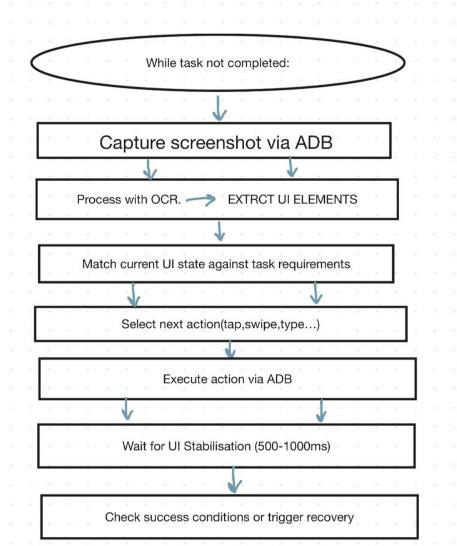

# AI Android Autonomous Agent

## Overview
An AI powered Android automation agent that understands user commands and performs actions on Android devices.

## Features
- Open applications
- Search on YouTube
- Send messages
- Navigate through apps
- Execute multi-step tasks

## Architecture

## Tech Stack
- Python
- Claude API
- ADB
- Android

## Workflow
1. User gives command
2. Claude interprets intent
3. Agent plans actions
4. ADB executes actions
5. Result returned

## Demo
[Video Link]

## Screenshots

